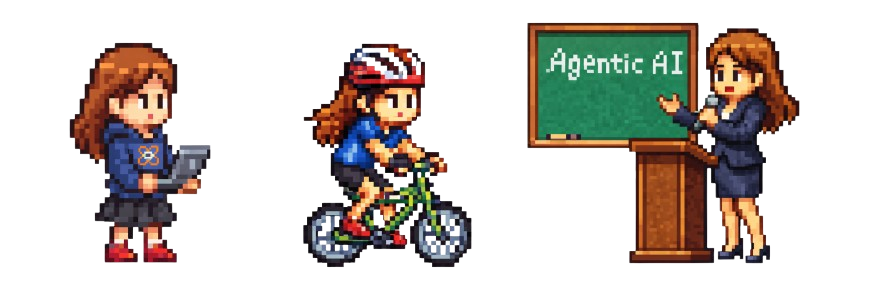

## Bonjour 👋

I'm Chloe, an Engineer in Physics with 10yrs+ experience in Project and Product management. I'm endlessly curious and never sure if it's a quality or a flaw, but anyway, here I am happily exploring and putting my hands in the dirt. Yeah!  
**Work experience** : AI (Inference, Agentic, GPU), Cloud Computing (Infrastructure, OEM-ODM, Docker payloads, MPI, etc.), Technical Program Management (Crossteam coordination, Benchmarking, Documentation), AI Consultant (Real Estate, Architecture, Entertainment), Data Science and Public Speaking.  
**Hobbies** : AI-ML Hackathons, ultratrail, bicycling around the world and learning FPGA.  
**Location** : Currently in SF/CA (US) 🇺🇸

List of projects from hackathons, personal hobbys or academic work. Some projects are private or as part of a company, and not shown here : 
- 👵 [vlm-monitoring-system](https://github.com/chloepilonv/angelcare-system) - An AI-powered monitoring system, that reasons (with fine-tuned Nvidia Cosmos Reason2 8B) on behaviors at risk of people living alone (Built with Claude)
- - 🔭 [interactive-catalogue](https://github.com/chloepilonv/interactive-catalogue) — Interactive museum catalogue builder with Gemini Vision Detector 
- 🧪 [ideas-recorder-raspberrypi](https://github.com/chloepilonv/voice-nightlight-raspberrypi) — A Rasberry Pi project that records my ideas at night, and send an email the next morning with the summary of it (Built with Claude)
- 🤖 [knowledgegraph-email-agent](https://github.com/chloepilonv/knowledgegraph-email-agent) — 2-hour hackathon AI agent with knowledge graph, qdrant embeddings & agentic email generation (Built with Claude)
- 🧠 [mcp-server-qarnot](https://github.com/chloepilonv/mcp-server-qarnot) — MCP server to let AI clients manage & query Qarnot tasks (Built with Claude)
- 📓 [blog-samples](https://github.com/chloepilonv/blog-samples) — Code used on Qarnot blog posts to launch scripts for Openfoam, Ansys, Starccm, etc. multiphysics simulation
- 💬 [ai-rag-chatbot-aws](https://github.com/chloepilonv/ai-rag-chatbot-aws) — RAG Chatbot that ingest Company documentation, as part of AWS AI Builder Hackathon (Built with Claude)
- 📈 [fake-github-contributions](https://github.com/chloepilonv/fake-github-contributions) — Playful fork for manipulating the GitHub contributions graph  
- 🚴‍♀️ [bikeparking-app-gmaps](https://github.com/chloepilonv/bikeparking-app-gmaps) — iOS app showing bike parking using Google Maps & Firebase, in SF 
- ⚙️ [gpumode-gemm-benchmarkingtool](https://github.com/chloepilonv/gpumode-gemm-benchmarkingtool) — GPU benchmarking tool for self-made GEMM vs Pytorch and Triton (Built with Claude)
- 🧪 [pinns-hacktoberfest](https://github.com/chloepilonv/pinns-hacktoberfest) — Physics Informed Neural Network on OpenFOAM (In total WIP) (Built with Claude)  
- 🔬 [percolation-theory-modeling](https://github.com/chloepilonv/percolation-theory-modeling) — Percolation and epidemiology modeling  

